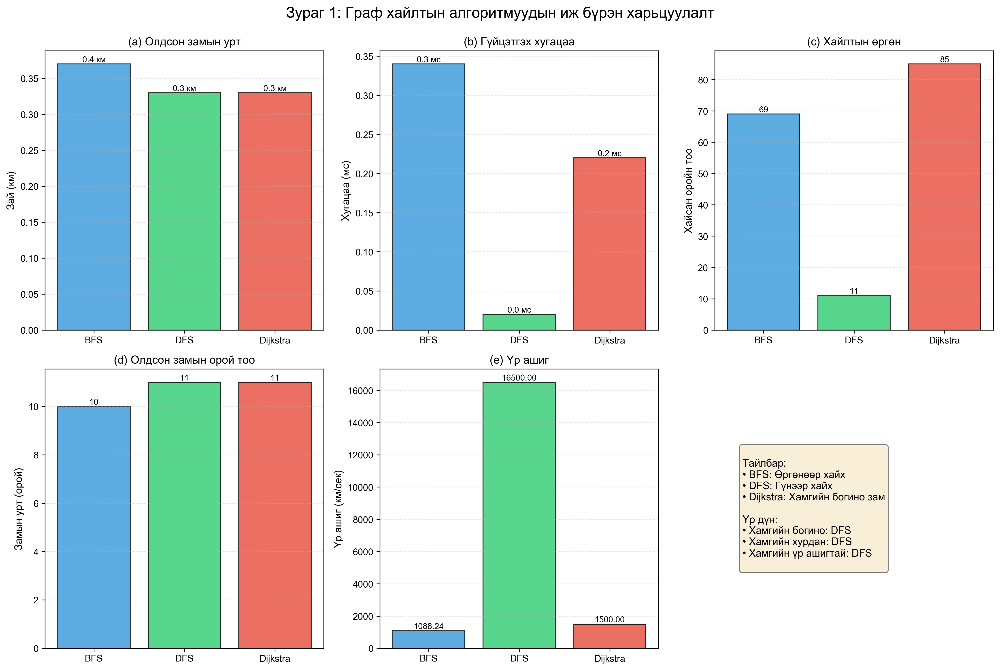

# 📄 Тайлан бэлтгэх иж бүрэн заавар

## Алхам 1: Туршилт ажиллуулж үр дүн авах

### 1.1 Тестийн скрипт ажиллуулах

```bash
cd /Users/jak/Downloads/lab1
source venv/bin/activate  # Хэрэв идэвхжүүлээгүй бол
python3 generate_report_data.py
```

Энэ нь дараах зүйлсийг үүсгэнэ:
- `test_results.json` - Бүх үр дүнгийн JSON файл
- `figure1_comparison_all.png` - 6 график бүхий харьцуулалт
- `figure2_distance_comparison.png` - Зайн харьцуулалт
- `figure3_time_comparison.png` - Хугацааны харьцуулалт
- `figure4_visited_comparison.png` - Хайсан оройн харьцуулалт
- `figure5_performance_summary.png` - Radar chart

### 1.2 Үр дүнг тайланд оруулах

`test_results.json` файлыг нээж үр дүнг `FINAL_REPORT.md` дахь `[test_results.json-с үр дүн]` хэсгүүдэд хуулж оруулах.

---

## Алхам 2: Тайлан бичих

### 2.1 FINAL_REPORT.md файлыг засах

1. **Хувийн мэдээлэл оруулах:**
   ```markdown
   **Оюутны нэр:** [Таны нэр]
   **Оюутны код:** [Таны код]
   **Багш:** [Багшийн нэр]
   **Огноо:** 2025-11-26
   ```

2. **Үр дүн оруулах:**
   Хаалттай `[...]` хэсгүүдэд бодит үр дүн оруулах:
   - `[V]` - Оройн тоо
   - `[E]` - Ирмэгийн тоо
   - `[test_results.json-с үр дүн]` - JSON файлаас хуулах

3. **Системийн мэдээлэл:**
   - Операцион систем
   - Процессор
   - RAM хэмжээ

### 2.2 Зураг оруулах

Зургууд аль хэдийн оруулагдсан:
```markdown

```

Зургууд **300 DPI** эсвэл дээш байх ёстой (аль хэдийн тохируулсан).

### 2.3 Caption шалгах

Зураг бүр дараах форматтай caption-тай:
```markdown
**Зураг X**: [Товч тайлбар]. [Дэлгэрэнгүй тайлбар].
```

Хүснэгт бүр:
```markdown
**Хүснэгт X**: [Тайлбар]
```

---

## Алхам 3: PDF үүсгэх

### Арга 1: Pandoc ашиглах (Санал болгох)

**Суулгах:**
```bash
# macOS
brew install pandoc
brew install basictex  # LaTeX engine

# Linux
sudo apt-get install pandoc texlive-full

# Windows
# https://pandoc.org/installing.html-с татаж суулгах
```

**PDF үүсгэх:**
```bash
cd /Users/jak/Downloads/lab1

pandoc FINAL_REPORT.md \
  -o REPORT.pdf \
  --pdf-engine=xelatex \
  -V geometry:margin=1in \
  -V fontsize=11pt \
  -V mainfont="Times New Roman" \
  -V CJKmainfont="Arial Unicode MS" \
  --toc \
  --toc-depth=3 \
  --number-sections \
  -V papersize=a4 \
  -V documentclass=article
```

**Зураг орохгүй бол:**
```bash
# Зургуудын замыг шалгаарай
ls -la *.png

# Хэрэв зураг олдохгүй бол, absolute path ашиглаарай
sed -i '' 's/figure/\/Users\/jak\/Downloads\/lab1\/figure/g' FINAL_REPORT.md
```

### Арга 2: Онлайн хөрвүүлэгч

**1. Markdown to PDF**
- https://www.markdowntopdf.com/
- FINAL_REPORT.md upload хийх
- Download PDF

**2. Dillinger**
- https://dillinger.io/
- Markdown paste хийх
- Export as PDF

**3. Typora** (Desktop апп)
- https://typora.io/
- Markdown файл нээх
- File → Export → PDF

### Арга 3: Google Docs / Microsoft Word

**1. Markdown → HTML хөрвүүлэх:**
```bash
pandoc FINAL_REPORT.md -o report.html
```

**2. HTML-г Word/Docs-д нээх:**
- Chrome дээр `report.html` нээх
- Бүх агуулгыг хуулах (Ctrl+A, Ctrl+C)
- Google Docs эсвэл Word-д буулгах
- Форматчлах:
  - Font: Times New Roman, 11pt
  - Line spacing: 1.5
  - Page: A4

**3. PDF болгож хадгалах:**
- File → Download → PDF

---

## Алхам 4: Форматчлал шалгах

### 4.1 Шаардлага

✅ **Хуудасны хэмжээ:** A4 (210 x 297 мм)
✅ **Фонт:** Times New Roman / Computer Modern
✅ **Фонтын хэмжээ:** 11pt
✅ **Line spacing:** 1.5 (optional)
✅ **Margin:** 1 inch
✅ **Файл төрөл:** PDF

### 4.2 Зургийн шаардлага

✅ **Чанар:** 300 DPI (аль хэдийн тохируулсан)
✅ **Төрөл:** PNG (вектор биш, гэхдээ өндөр чанартай)
✅ **Caption:** Бүх зурагт байна
✅ **Дугаарлалт:** Зураг 1-6

### 4.3 Хүснэгтийн шаардлага

✅ **Caption:** Хүснэгт 1-6
✅ **Форматчлалт:** Markdown table
✅ **Уншигдах:** Тодорхой, ойлгомжтой

---

## Алхам 5: Тайлан илгээх

### 5.1 Илгээх файлууд

**1. Үндсэн тайлан:**
```
REPORT.pdf
```

**2. Нэмэлт файлууд (optional):**
```bash
# Бүх файлыг нэгтгэх
zip -r lab1_submission.zip \
  REPORT.pdf \
  *.png \
  test_results.json \
  read_osm.py \
  app.py \
  templates/ \
  requirements.txt \
  README.md
```

### 5.2 Файлын хэмжээ

Хэрэв ZIP файл хэтэрхий том бол:
```bash
# Зургуудыг багасгах
mkdir optimized
for file in *.png; do
  convert "$file" -quality 85 -resize 80% "optimized/$file"
done

# Shapefile оруулахгүй (хэтэрхий том)
zip -r lab1_submission.zip \
  REPORT.pdf \
  optimized/*.png \
  test_results.json \
  *.py \
  templates/ \
  requirements.txt \
  README.md
```

---

## Алхам 6: Сайн туршилтын зөвлөмж

### 6.1 Тайлан бичихдээ

✅ **Тодорхой:** Техник нэр томъёог тайлбарла
✅ **Бүрэн:** Бүх алгоритмыг хамрах
✅ **Шинжилгээтэй:** Зүгээр үр дүн бус, тайлбар нэм
✅ **Харьцуулалттай:** Алгоритмуудыг харьцуулж дүгнэ
✅ **Дүрслэлтэй:** График, хүснэгт ашигла

### 6.2 Академик бичиг

✅ Би/Бид хэллэг ашиглах
✅ Албан ёсны стиль хадгалах
✅ Эх сурвалж дурдах [1], [2] гэх мэт
✅ Нэр томъёог тайлбарлах

### 6.3 Зураг ба хүснэгт

✅ Бүх зураг тайлбартай
✅ Бүх хүснэгт тайлбартай
✅ Тайлан дотор иш татах (Зураг 1-г үз)
✅ Логиктой дараалал

---

## Алхам 7: Түгээмэл асуудал шийдвэр

### Q1: Зураг харагдахгүй байна

**Шийдэл:**
```bash
# Зургууд үнэхээр байгаа эсэхийг шалгах
ls -la *.png

# generate_report_data.py дахин ажиллуулах
python3 generate_report_data.py

# PDF үүсгэхдээ --resource-path нэмэх
pandoc FINAL_REPORT.md -o REPORT.pdf \
  --resource-path=. \
  --pdf-engine=xelatex
```

### Q2: Монгол үсэг гарахгүй байна

**Шийдэл:**
```bash
# CJK font заах
pandoc FINAL_REPORT.md -o REPORT.pdf \
  --pdf-engine=xelatex \
  -V CJKmainfont="Arial Unicode MS"

# Эсвэл
-V mainfont="Arial Unicode MS"
```

### Q3: Pandoc суулгахад асуудал

**Шийдэл:**
- Арга 2 эсвэл 3 ашиглах (онлайн хөрвүүлэгч эсвэл Word)
- Docker ашиглах:
```bash
docker run --rm -v $(pwd):/data pandoc/latex \
  FINAL_REPORT.md -o REPORT.pdf
```

### Q4: Хүснэгт муу харагдаж байна

**Шийдэл:**
```markdown
<!-- Markdown хүснэгт оронд HTML ашиглах -->
<table>
  <tr>
    <th>Алгоритм</th>
    <th>Зай</th>
  </tr>
  <tr>
    <td>BFS</td>
    <td>12.5 км</td>
  </tr>
</table>
```

---

## Хавсралт: Бүрэн командууд

### Бүгдийг нэг дор хийх:

```bash
#!/bin/bash
# PDF үүсгэх бүрэн скрипт

cd /Users/jak/Downloads/lab1

echo "1. Virtual environment идэвхжүүлж байна..."
source venv/bin/activate

echo "2. Туршилт ажиллуулж байна..."
python3 generate_report_data.py

echo "3. Үр дүнг шалгаж байна..."
ls -la *.png test_results.json

echo "4. PDF үүсгэж байна..."
pandoc FINAL_REPORT.md \
  -o REPORT.pdf \
  --pdf-engine=xelatex \
  -V geometry:margin=1in \
  -V fontsize=11pt \
  -V mainfont="Times New Roman" \
  --toc \
  --number-sections \
  -V papersize=a4

echo "5. Амжилттай!"
echo "REPORT.pdf файл үүслээ"
open REPORT.pdf
```

Энэ скриптийг хадгалж `create_pdf.sh` нэртэй болгоод:
```bash
chmod +x create_pdf.sh
./create_pdf.sh
```

---

## Дүгнэлт

Эдгээр алхмуудыг дагавал та **300 DPI зураг, тайлбартай хүснэгт, бүрэн дүн шинжилгээ бүхий** мэргэжлийн тайлан үүсгэх болно!

**Амжилт хүсье!** 🎓📝

---

Асуулт байвал: README.md эсвэл SHAPEFILE_SETUP.md-г уншаарай.

