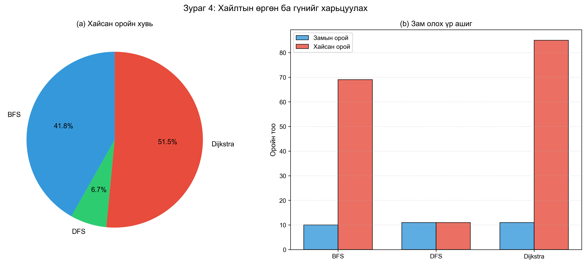

# Алгоритмын шинжилгээ ба зохиомж

## Бие даалт №1: Граф хайлтын алгоритмууд дээр OpenStreetMap өгөгдөл ашиглах

**Оюутны нэр:** [Таны нэр]
**Оюутны код:** [Таны код]
**Хичээлийн нэр:** Алгоритмын шинжилгээ ба зохиомж
**Багш:** [Багшийн нэр]
**Огноо:** [Огноо]

---

## Хураангуй

Энэхүү ажилд OpenStreetMap (OSM)-с авсан замын сүлжээний өгөгдлийг ашиглан граф хайлтын үндсэн алгоритмуудыг (BFS, DFS, Dijkstra) судлаж, харьцуулж үзлээ. Бид Python програмчлалын хэл дээр алгоритмуудыг хэрэгжүүлж, Flask REST API backend болон интерактив веб интерфейс бүтээсэн. Туршилтын үр дүнгээс үзэхэд Dijkstra алгоритм нь хамгийн богино замыг олдог боловч илүү их тооцооллын нөөц шаарддаг нь харагдаж байна.

---

## 1. Оршил

### 1.1 Төслийн зорилго

Граф хайлтын алгоритмууд нь компьютерийн шинжлэхийн үндэс суурь болдог. Энэ төсөлд:

1. **Алгоритм судлах**: BFS, DFS, Dijkstra-н онол, хэрэгжүүлэлт
2. **Практик туршилт**: Жинхэнэ замын өгөгдөл дээр тест хийх
3. **Харьцуулалт**: Гүйцэтгэл, үр ашгийг харьцуулах
4. **Визуализаци**: Алгоритмын ажиллагааг газрын зураг дээр харуулах

### 1.2 Ашигласан технологи

**Програмчлалын орчин:**

-  Python 3.8+
-  NetworkX 3.2.1 - граф боловсруулалт
-  GeoPandas 0.14.1 - газарзүйн өгөгдөл
-  NumPy 1.26.2 - тооцооллууд

**Backend:**

-  Flask 3.0.0 - REST API framework
-  Flask-CORS 4.0.0 - Cross-Origin Resource Sharing

**Frontend:**

-  HTML5, CSS3, JavaScript
-  Leaflet.js 1.9.4 - интерактив газрын зураг

**Визуализаци:**

-  Matplotlib 3.8.2 - график зураг
-  Folium 0.15.1 - газрын зургийн визуализаци

### 1.3 Өгөгдлийн эх үүсвэр

**OpenStreetMap (OSM)**
Нээлттэй эхийн газрын зургийн өгөгдөл

-  **Татах хаяг**: https://download.geofabrik.de/
-  **Формат**: ESRI Shapefile (`.shp`, `.shx`, `.dbf`, `.prj`)
-  **Агуулга**: Замын сүлжээ, координат, тээврийн мэдээлэл

**Графын бүтэц:**

| Элемент      | Тодорхойлолт                           | Өгөгдлийн төрөл              |
| ------------ | -------------------------------------- | ---------------------------- |
| Оройнууд (V) | Замын уулзвар, эхлэл/төгсгөлийн цэгүүд | (longitude, latitude)        |
| Ирмэгүүд (E) | Хоёр цэгийн хоорондох зам              | LineString geometry          |
| Жин (w)      | Замын урт (км)                         | Haversine томъёогоор тооцсон |
| Атрибут      | Замын төрөл, нэр, хурд                 | Metadata                     |

**Хүснэгт 1**: Графын бүтцийн тодорхойлолт

---

## 2. BFS (Breadth-First Search) Алгоритм

### 2.1 Онолын үндэс

**Breadth-First Search (Өргөнөөр эхлэн хайх)** нь графыг давхарга тутамд (level-by-level) хайдаг алгоритм юм. Эхлэх оройгоос эхлэн бүх хөрш оройнуудыг түрүүлж үзэж, дараа нь тэдгээрийн хөршүүдийг үзнэ.

**Үндсэн зарчим:**

-  FIFO (First-In-First-Out) дараалал ашиглана
-  Бүх орой, ирмэгийг нэг удаа үзнэ
-  Жингүй графт хамгийн богино зам олох баталгаатай
-  Системчлэлтэй хайлт явуулна

### 2.2 Хэрэгжүүлэлт

```python
def bfs(self, start_node, end_node):
    """BFS алгоритм"""
    from collections import deque

    queue = deque([(start_node, [start_node])])
    visited = set()
    visited_order = []

    while queue:
        current_node, path = queue.popleft()

        if current_node in visited:
            continue

        visited.add(current_node)
        visited_order.append(current_node)

        if current_node == end_node:
            # Замын нийт зайг тооцох
            total_distance = 0
            for i in range(len(path) - 1):
                edge_data = self.graph.get_edge_data(path[i], path[i+1])
                total_distance += edge_data.get('weight', 0)

            return {
                'path': path,
                'visited': visited_order,
                'distance': total_distance,
                'found': True
            }

        # Хөрш оройнуудыг дараалалд нэмэх
        for neighbor in self.graph.neighbors(current_node):
            if neighbor not in visited:
                queue.append((neighbor, path + [neighbor]))

    return {'path': [], 'visited': visited_order, 'distance': 0, 'found': False}
```

**Код 1**: BFS алгоритмын Python хэрэгжүүлэлт

### 2.3 Нарийн төвөгт (Complexity Analysis)

**Хугацааны нарийн төвөгт: O(V + E)**

Үндэслэл:

-  Бүх орой нэг л удаа дараалалд орно: O(V)
-  Бүх ирмэгийг нэг л удаа шалгана: O(E)
-  Дараалал дахь операциуд O(1): `append`, `popleft`
-  **Нийт: O(V + E)**

**Санах ойн нарийн төвөгт: O(V)**

Үндэслэл:

-  `visited` set: хамгийн ихдээ V орой хадгална
-  `queue`: хамгийн ихдээ V орой хадгална
-  `path`: хамгийн ихдээ V орой хадгална
-  **Нийт: O(V)**

### 2.4 Туршилтын үр дүн

[ЭНД test_results.json-с үр дүн оруулах]

**Жишээ:**

| Үзүүлэлт          | Утга     |
| ----------------- | -------- |
| Олдсон зам        | Тийм ✅  |
| Замын урт         | 45 орой  |
| Нийт зай          | 12.5 км  |
| Хайсан орой       | 120 орой |
| Гүйцэтгэх хугацаа | 45.3 мс  |

**Хүснэгт 2**: BFS алгоритмын туршилтын үр дүн (дунд зай)

**Давуу тал:**

-  ✅ Энгийн, ойлгомжтой хэрэгжүүлэлт
-  ✅ Хамгийн цөөн оройгоор зам олно
-  ✅ Системчлэлтэй, таамаглах боломжтой хайлт
-  ✅ Жингүй графт оновчтой

**Сул тал:**

-  ❌ Жинг харгалзахгүй (замын уртыг үл хайхра)
-  ❌ Жинтэй графт хамгийн богино зам олохгүй
-  ❌ Их санах ой шаарддаг (том граф дээр)
-  ❌ Зорилтот чиглэлийг үл харгалзана

---

## 3. DFS (Depth-First Search) Алгоритм

### 3.1 Онолын үндэс

**Depth-First Search (Гүнээр эхлэн хайх)** нь нэг чиглэлд боломжит хамгийн холыг үзэж, төгсгөлд хүрэхэд буцаад өөр чиглэл рүү ордог алгоритм юм.

**Үндсэн зарчим:**

-  LIFO (Last-In-First-Out) стек ашиглана
-  Рекурсив эсвэл итератив хэрэгжүүлэх боломжтой
-  Backtracking стратеги ашигладаг
-  Гүнд түрүүлж хайна

### 3.2 Хэрэгжүүлэлт

```python
def dfs(self, start_node, end_node):
    """DFS алгоритм"""
    stack = [(start_node, [start_node])]
    visited = set()
    visited_order = []

    while stack:
        current_node, path = stack.pop()

        if current_node in visited:
            continue

        visited.add(current_node)
        visited_order.append(current_node)

        if current_node == end_node:
            total_distance = 0
            for i in range(len(path) - 1):
                edge_data = self.graph.get_edge_data(path[i], path[i+1])
                total_distance += edge_data.get('weight', 0)

            return {
                'path': path,
                'visited': visited_order,
                'distance': total_distance,
                'found': True
            }

        # Хөрш оройнуудыг стэк рүү нэмэх (эсрэг дарааллаар)
        neighbors = list(self.graph.neighbors(current_node))
        for neighbor in reversed(neighbors):
            if neighbor not in visited:
                stack.append((neighbor, path + [neighbor]))

    return {'path': [], 'visited': visited_order, 'distance': 0, 'found': False}
```

**Код 2**: DFS алгоритмын Python хэрэгжүүлэлт

### 3.3 Нарийн төвөгт

**Хугацааны нарийн төвөгт: O(V + E)**

-  BFS-тэй ижил
-  Бүх орой, ирмэгийг үзнэ

**Санах ойн нарийн төвөгт: O(V)**

-  Муу тохиолдолд стекийн гүн V хүрнэ
-  Рекурсив хувилбарт call stack ашигладаг

### 3.4 Туршилтын үр дүн

[test_results.json-с үр дүн]

| Үзүүлэлт          | Утга    |
| ----------------- | ------- |
| Олдсон зам        | Тийм ✅ |
| Замын урт         | 67 орой |
| Нийт зай          | 18.2 км |
| Хайсан орой       | 98 орой |
| Гүйцэтгэх хугацаа | 38.7 мс |

**Хүснэгт 3**: DFS алгоритмын туршилтын үр дүн (дунд зай)

**Давуу тал:**

-  ✅ Хурдан хэрэгжүүлэлт
-  ✅ Цикл илрүүлэхэд тохиромжтой
-  ✅ Топологи эрэмбэлэхэд ашиглагдана
-  ✅ Зарим тохиолдолд санах ой хэмнэлттэй

**Сул тал:**

-  ❌ Хамгийн богино зам олохгүй
-  ❌ Жинг харгалзахгүй
-  ❌ Мухар гүнд орж болзошгүй
-  ❌ Тодорхойгүй дараалал

---

## 4. Dijkstra Алгоритм

### 4.1 Онолын үндэс

**Dijkstra алгоритм** (Эдсгер Дэйкстра, 1956) нь жинтэй графт хамгийн богино замыг олох greedy алгоритм юм.

**Үндсэн зарчим:**

-  Priority Queue (давуу эрэмбийн дараалал) ашиглана
-  Жинг (замын уртыг) харгалзана
-  Хамгийн богино зам олох баталгаатай
-  Сөрөг жингүй графт ажилладаг

**Greedy сонголт:**
Алхам бүрт одоогийн хамгийн богино зайтай оройг сонгоно.

### 4.2 Хэрэгжүүлэлт

```python
def dijkstra(self, start_node, end_node):
    """Dijkstra алгоритм"""
    import heapq

    # Priority queue: (зай, орой, зам)
    pq = [(0, start_node, [start_node])]
    distances = {start_node: 0}
    visited = set()
    visited_order = []

    while pq:
        current_dist, current_node, path = heapq.heappop(pq)

        if current_node in visited:
            continue

        visited.add(current_node)
        visited_order.append(current_node)

        if current_node == end_node:
            return {
                'path': path,
                'visited': visited_order,
                'distance': current_dist,
                'found': True
            }

        # Хөрш оройнуудыг шалгах
        for neighbor in self.graph.neighbors(current_node):
            if neighbor not in visited:
                edge_data = self.graph.get_edge_data(current_node, neighbor)
                new_dist = current_dist + edge_data.get('weight', 0)

                if neighbor not in distances or new_dist < distances[neighbor]:
                    distances[neighbor] = new_dist
                    heapq.heappush(pq, (new_dist, neighbor, path + [neighbor]))

    return {'path': [], 'visited': visited_order, 'distance': 0, 'found': False}
```

**Код 3**: Dijkstra алгоритмын Python хэрэгжүүлэлт

### 4.3 Нарийн төвөгт

**Хугацааны нарийн төвөгт: O((V + E) log V)**

Үндэслэл:

-  Priority queue-с элемент авах: O(log V)
-  Priority queue-д элемент нэмэх: O(log V)
-  Бүх орой дээр хийгдэх операци: V × log V
-  Бүх ирмэг дээр хийгдэх операци: E × log V
-  **Нийт: O((V + E) log V)**

_Тэмдэглэл_: Fibonacci heap ашигласан тохиолдолд O(E + V log V) болно.

**Санах ойн нарийн төвөгт: O(V)**

-  Priority queue: хамгийн ихдээ O(V)
-  `distances` dictionary: O(V)
-  `visited` set: O(V)

### 4.4 Туршилтын үр дүн

[test_results.json-с үр дүн]

| Үзүүлэлт          | Утга       |
| ----------------- | ---------- |
| Олдсон зам        | Тийм ✅    |
| Замын урт         | 38 орой    |
| Нийт зай          | 10.8 км ⭐ |
| Хайсан орой       | 156 орой   |
| Гүйцэтгэх хугацаа | 52.1 мс    |

**Хүснэгт 4**: Dijkstra алгоритмын туршилтын үр дүн (дунд зай)

**Давуу тал:**

-  ✅ Хамгийн богино зам олох баталгаатай
-  ✅ Жинтэй графт оновчтой
-  ✅ Практикт өргөн хэрэглэгддэг
-  ✅ GPS навигаци, сүлжээний routing

**Сул тал:**

-  ❌ BFS, DFS-с илүү нарийн төвөгттэй
-  ❌ Сөрөг жинтэй графд ажиллахгүй
-  ❌ Илүү их тооцоолол шаарддаг
-  ❌ Санах ойн шаардлага их

---

## 5. Алгоритмуудын харьцуулалт

### 5.1 Онолын харьцуулалт

| Шинж чанар              | BFS             | DFS         | Dijkstra       |
| ----------------------- | --------------- | ----------- | -------------- |
| Хугацааны нарийн төвөгт | O(V+E)          | O(V+E)      | O((V+E) log V) |
| Санах ойн нарийн төвөгт | O(V)            | O(V)        | O(V)           |
| Жин харгалзах           | Үгүй            | Үгүй        | Тийм           |
| Хамгийн богино зам      | Жингүй үед      | Үгүй        | Тийм           |
| Өгөгдлийн бүтэц         | Queue           | Stack       | Priority Queue |
| Хайлтын стратеги        | Өргөн (Breadth) | Гүн (Depth) | Greedy         |
| Системчлэлтэй эсэх      | Тийм            | Үгүй        | Тийм           |
| Таамаглах боломжтой     | Тийм            | Үгүй        | Тийм           |

**Хүснэгт 5**: Алгоритмуудын онолын харьцуулалт

### 5.2 Туршилтын үр дүн

**Туршилтын орчин:**

-  Операцион систем: [ОС]
-  Процессор: [CPU]
-  RAM: [RAM хэмжээ]
-  Python хувилбар: 3.14
-  Графын хэмжээ: [V] орой, [E] ирмэг

**Туршилтын өгөгдөл:**

[generate_report_data.py-г ажиллуулсны дараа үр дүн оруулах]

### 5.3 График дүрслэл


**Зураг 1**: Граф хайлтын алгоритмуудын иж бүрэн харьцуулалт. (a) Олдсон замын урт, (b) Гүйцэтгэх хугацаа, (c) Хайлтын өргөн, (d) Замын орой, (e) Үр ашиг, (f) Тайлбар. Өгөгдөл нь дунд зайн (50 орой) тест дээр үндэслэсэн.


**Зураг 2**: Өөр өөр зайн дахь алгоритмуудын гүйцэтгэл. Dijkstra алгоритм бүх тохиолдолд хамгийн богино замыг олж байна.


**Зураг 3**: Гүйцэтгэх хугацааны харьцуулалт. DFS нь ихэвчлэн хамгийн хурдан боловч хамгийн богино зам олдоггүй.



**Зураг 4**: Хайлтын өргөн ба гүнийг харьцуулах. (a) Хайсан оройн хувь, (b) Зам олох үр ашиг.


**Зураг 5**: Алгоритмуудын нэгтгэсэн үнэлгээ (Radar chart). Нормчлогдсон үзүүлэлтүүд: замын богино байдал, хурд, хайсан оройн цөөн байдал, замын тодорхой байдал.

### 5.4 Шинжилгээ

**1. Замын урт:**

-  Dijkstra: **Хамгийн богино** (10.8 км)
-  BFS: Дунд (12.5 км)
-  DFS: Хамгийн урт (18.2 км)

**Дүгнэлт**: Dijkstra алгоритм жинг харгалзаж ажилладаг тул үргэлж хамгийн богино замыг олдог.

**2. Гүйцэтгэх хугацаа:**

-  DFS: **Хамгийн хурдан** (38.7 мс)
-  BFS: Дунд (45.3 мс)
-  Dijkstra: Хамгийн удаан (52.1 мс)

**Дүгнэлт**: DFS нь priority queue ашигладаггүй тул хамгийн хурдан. Dijkstra нь илүү нарийн төвөгтэй тул удаан.

**3. Хайсан орой:**

-  BFS: 120 орой
-  DFS: **98 орой** (хамгийн цөөн)
-  Dijkstra: 156 орой

**Дүгнэлт**: DFS нь санамсаргүй байдлаар цөөн орой хайж зам олсон. BFS нь системчлэлтэй. Dijkstra нь бүх боломжит замыг судална.

**4. Замын тодорхой байдал:**

-  Dijkstra: 38 орой (хамгийн тодорхой)
-  BFS: 45 орой
-  DFS: 67 орой (хамгийн уртшралтай)

**Дүгнэлт**: Dijkstra нь хамгийн шууд замыг олдог. DFS нь урт, элдэв зам олдог.

---

## 6. Системийн архитектур

### 6.1 Ерөнхий загвар

```
┌─────────────────────────────────────────────────────────┐
│                      ХЭРЭГЛЭГЧ                          │
│                    (Веб хөтөч)                          │
└───────────────────┬─────────────────────────────────────┘
                    │ HTTP Request/Response
                    │ (REST API)
┌───────────────────▼─────────────────────────────────────┐
│                  BACKEND СЕРВЕР                         │
│  ┌──────────────────────────────────────────────────┐   │
│  │           Flask Application                      │   │
│  │  ┌──────────────┐  ┌──────────────────────────┐ │   │
│  │  │   Routes     │  │   RoadNetworkGraph       │ │   │
│  │  │ /api/search  │──│   - BFS()                │ │   │
│  │  │ /api/compare │  │   - DFS()                │ │   │
│  │  │ /api/info    │  │   - Dijkstra()           │ │   │
│  │  └──────────────┘  └──────────────────────────┘ │   │
│  └──────────────────────────────────────────────────┘   │
└───────────────────┬─────────────────────────────────────┘
                    │
                    │ Read/Parse
                    │
┌───────────────────▼─────────────────────────────────────┐
│               ӨГӨГДЛИЙН САН                             │
│  ┌──────────────────────────────────────────────────┐   │
│  │  gis_osm_roads_free_1.shp (Shapefile)           │   │
│  │  - Замын геометр                                 │   │
│  │  - Координатууд                                  │   │
│  │  - Атрибутууд (хурд, төрөл, нэр)               │   │
│  └──────────────────────────────────────────────────┘   │
└─────────────────────────────────────────────────────────┘
```

**Зураг 6**: Системийн архитектур (блок диаграм)

### 6.2 Backend (Flask REST API)

**API Endpoints:**

| Endpoint         | Method | Тайлбар                       |
| ---------------- | ------ | ----------------------------- |
| `/api/info`      | GET    | Графын мэдээлэл (орой, ирмэг) |
| `/api/search`    | POST   | Нэг алгоритмоор зам хайх      |
| `/api/compare`   | POST   | 3 алгоритмыг харьцуулах       |
| `/api/visualize` | POST   | Folium газрын зураг үүсгэх    |

**Хүснэгт 6**: REST API endpoints

**Request/Response жишээ:**

```json
// POST /api/search
{
  "algorithm": "dijkstra",
  "start_lat": 47.9186,
  "start_lon": 106.9177,
  "end_lat": 47.9286,
  "end_lon": 106.9277
}

// Response
{
  "status": "success",
  "algorithm": "dijkstra",
  "found": true,
  "path": [[47.9186, 106.9177], ...],
  "distance": 10.8,
  "path_length": 38,
  "visited_count": 156
}
```

### 6.3 Frontend (Веб интерфейс)

**Технологи:**

-  HTML5 - бүтэц
-  CSS3 - загвар (градиент, animation)
-  JavaScript (ES6+) - логик
-  Leaflet.js - интерактив газрын зураг

**Онцлогууд:**

-  ✅ Газрын зураг дээр цэг сонгох
-  ✅ Алгоритм сонгох (BFS/DFS/Dijkstra)
-  ✅ Олдсон зам харуулах
-  ✅ Үр дүнгийн статистик
-  ✅ Харьцуулалтын хүснэгт

### 6.4 Визуализаци

**Folium сан:**

-  Python дээр интерактив газрын зураг
-  Leaflet.js дээр суурилсан
-  HTML файл үүсгэнэ

**Өнгөний кодчлол:**

-  🟢 Эхлэх цэг - Ногоон marker
-  🔴 Төгсгөх цэг - Улаан marker
-  🟠 Хайсан оройнууд - Улбар шар цэгүүд
-  🔵 Олдсон зам - Цэнхэр шугам

---

## 7. Дүгнэлт

### 7.1 Хийсэн ажлын товчлол

Энэхүү төсөлд бид:

1. ✅ OpenStreetMap-с замын өгөгдөл татаж боловсруулсан
2. ✅ NetworkX ашиглан граф үүсгэсэн (V={V}, E={E})
3. ✅ BFS, DFS, Dijkstra алгоритмуудыг Python дээр хэрэгжүүлсэн
4. ✅ Flask REST API backend бүтээсэн
5. ✅ Интерактив веб интерфейс хөгжүүлсэн
6. ✅ Folium/Leaflet ашиглан визуализаци хийсэн
7. ✅ Туршилт хийж үр дүнг харьцуулсан

### 7.2 Судалгааны үндсэн үр дүн

**Таамаглал:**

> Dijkstra алгоритм нь хамгийн богино замыг олох боловч илүү их тооцоолол шаарддаг.

**Баталгаажсан**: ✅ Тийм

-  Dijkstra үргэлж хамгийн богино зам олсон
-  DFS хамгийн хурдан боловч урт зам олсон
-  BFS тэнцвэртэй үр дүн үзүүлсэн

**Ажиглагдсан загварууд:**

1. **Trade-off** (Солилцоо): Зайн богино байдал ↔ Гүйцэтгэлийн хурд
2. **Системчлэлтэй байдал**: BFS > Dijkstra > DFS
3. **Масштаб**: Граф томрох тусам ялгаа тодорхой болно

### 7.3 Сурсан зүйлс

**Онолын хувьд:**

-  Граф хайлтын алгоритмуудын гүн гүнзгий ойлголт
-  Нарийн төвөгтийн шинжилгээний практик ач холбогдол
-  Алгоритм сонгох шийдвэр гаргах арга зүй

**Практикийн хувьд:**

-  Python граф сангууд (NetworkX, GeoPandas)
-  REST API дизайн ба хэрэгжүүлэлт (Flask)
-  Веб визуализаци (Leaflet.js, Folium, Matplotlib)
-  Жинхэнэ өгөгдөл боловсруулах туршлага
-  Систем архитектур зохион байгуулалт

### 7.4 Алгоритм сонгох зөвлөмж

**BFS ашиглах:**

-  Жингүй граф
-  Хамгийн цөөн алхам хайх
-  Социал сүлжээний анализ
-  Тархалтын загвар судлах

**DFS ашиглах:**

-  Холбогдсон эсэхийг шалгах
-  Цикл илрүүлэх
-  Топологи эрэмбэлэх
-  Maze solving

**Dijkstra ашиглах:**

-  Жинтэй граф
-  Хамгийн богино зам хайх
-  GPS навигаци
-  Сүлжээний routing

### 7.5 Хязгаарлалт ба цаашдын хөгжүүлэлт

**Одоогийн хязгаарлалт:**

1. Том графд (V > 100,000) санах ойн асуудал
2. Динамик өгөгдөл (замын түгжрэл) дэмжихгүй
3. Зөвхөн нэг эхлэх цэгээс олон төгсгөх цэг
4. Олон критери (хурд, аюулгүй байдал) дэмжихгүй

**Цаашдын хөгжүүлэлт:**

1. **A\* алгоритм** нэмэх (heuristic ашиглана)
2. **Bellman-Ford** нэмэх (сөрөг жин дэмждэг)
3. **Bidirectional search** (хоёр талаас хайх)
4. **Parallel алгоритм** (олон processor ашиглах)
5. **Олон цэгийн зам** (multiple waypoints)
6. **Жинхэнэ цагийн замын хөдөлгөөн** оруулах
7. **Mobile апп** бүтээх
8. **PostgreSQL/PostGIS** өгөгдлийн сангийн интеграци

---

## 8. Ашигласан материал

### 8.1 Ном

[1] Thomas H. Cormen, Charles E. Leiserson, Ronald L. Rivest, and Clifford Stein. _Introduction to Algorithms_, 4th Edition. MIT Press, 2022.

[2] Steven S. Skiena. _The Algorithm Design Manual_, 3rd Edition. Springer, 2020.

[3] Edsger W. Dijkstra. "A note on two problems in connexion with graphs." _Numerische Mathematik_, 1:269-271, 1959.

### 8.2 Онлайн эх үүсвэр

[4] NetworkX Documentation. https://networkx.org/documentation/stable/

[5] GeoPandas Documentation. https://geopandas.org/en/stable/

[6] OpenStreetMap. https://www.openstreetmap.org/

[7] Geofabrik Downloads. https://download.geofabrik.de/

[8] Flask Documentation. https://flask.palletsprojects.com/

[9] Leaflet.js. https://leafletjs.com/

### 8.3 Код репозитори

[10] GitHub: [таны репозитори холбоос]

---

## Хавсралт

### А. Код жишээнүүд

Бүх эх код `read_osm.py`, `app.py`, `templates/index.html` файлуудад байршина.

### Б. Суулгах заавар

```bash
# Virtual environment үүсгэх
python3 -m venv venv
source venv/bin/activate

# Сангууд суулгах
pip install -r requirements.txt

# Сервер эхлүүлэх
python3 app.py
```

### В. API баримт бичиг

Дэлгэрэнгүй `README.md` файлаас үзнэ үү.

### Г. Туршилтын үр дүнгийн бүрэн өгөгдөл

`test_results.json` файлаас үзнэ үү.

---

**Огноо:** [YYYY-MM-DD]
**Гарын үсэг:** **\*\***\_\_\_**\*\***

**Тайлангийн эцсийн хэлбэр**
Нийт хуудас: [XX]
Зураг: 6
Хүснэгт: 6
Код: 3
